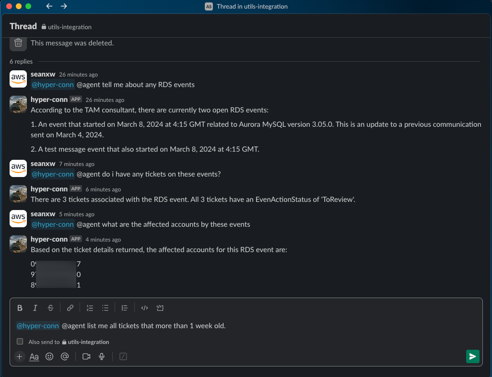
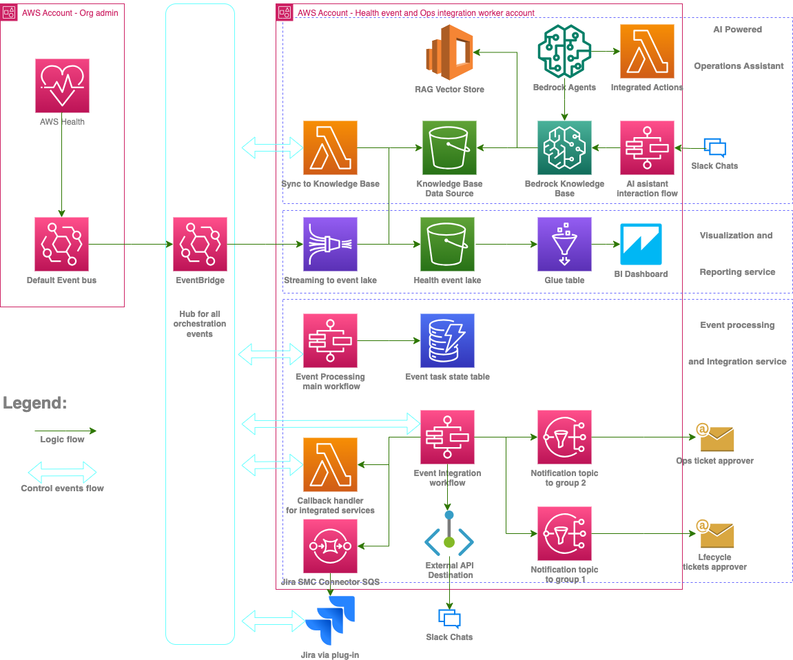

# Power cloud operations by AWS Health events and Gen-AI

- This project is built on AWS and deployable using AWS CDK as IaaC (Infrastructure as code).
- A working illustration of how AWS Heath events and gen-AI can be integrated into cloud operations to improve resilience and efficiency
- Can be built further on to integrate with more types of events and other internal/external services of yours.
- Built fully on serverless and event-driven architecture (EDA) on AWS
- Cost of running/hosting on AWS should be less than US$5 per month with reasonable amount of events consumed.
- (Optional) Cost of hosting the AI-augmented stack is subject to the actual consumption of queries and the size of vector store, please consult [AWS Bedrock pricing](https://aws.amazon.com/bedrock/pricing/) and [AWS OpenSearch pricing](https://aws.amazon.com/opensearch-service/pricing/#Amazon_OpenSearch_Serverless) for pricing details. 

## Highlights of what is contained
- An AWS Health event processing microservice to consume organization health events and an example tracking/triage workflow.
- A health event integration microservice to manage 3rd party service integrations (used Slack and Amazon DynamoDB as example but can be extended to integrate with Jira and ServiceNow via free plugins from AWS Marketplace).
- A visualization microservice with an S3 event data lake and AWS Quicksight at its core (QuickSight BI dashboards is work-in-progress)
- A knowledge base backed by a serverless vector store with Amazon Bedrock API running on top to provide RAG-based (Retrieval Augmented Generation) gen-AI powered chatbot via Slack as the interface
- A chatbot using Slack as the UI to interact with the backend gen-AI features, similar functionalities can be implemented on MS TEAMS.
- A multi-agent implementation that can be used side-by-side with the RAG-based chatbot to illustrate the power of multi-agent design using Amazon Bedrock Agent on top of LLMs

## Prerequisites
- At least 1 AWS account with appropriate permissions. The project uses a typical setup of 2 accounts where as 1 is the org admin account and the other is the worker account hosting all the microservices.
- A Slack app and a channel set up with appropriate permissions and event subscriptions to send/receive messages to/from backend microservices. This is optional if you wanted to skip the notification function integrated with Slack and AI chatbot related features.
- AWS CDK installed on your local environment for stack deployment
- AWS SAM (Serverless Application Model) and Docker installed on your local environment to build Lambda images
  
## Screenshots of Usage
### Integration to Health events to triage ticket creation/update

</p>

### RAG-powered AI operations assistant chatbot

</p>

### Multi-agent implementation to illustrate the design of >1 agents (each with unique domain of expertise) teaming up to solve more complex tasks (1 agent playing the role of an operations/ticketing specialist and another one acting as a technical consultant equiped with AWS Health event knowledge base)

</p>

## Architecture
<p align="left">

</p>

## Deployment steps
### Copy repo to your local directory
```zsh
git clone https://github.com/InitialXW/aws-health-integration.git
cd aws-health-integration
npm install
cdk bootstrap aws://<your admin AWS account id>/<region where you Organization is> aws://<your worker AWS account id>/<region where your worker services to be>
cd lambda/src
# Depending on your build environment, you might want o change the arch type to x84 or arm in lambda/src/template.yaml file before build 
sam build --use-container
cd ../..
```
### Create an '.env' file under project root directory that contains the following
```zsh
CDK_ADMIN_ACCOUNT=<replace with your 12 digits admin AWS account id>
CDK_PROCESSING_ACCOUNT=<replace with your 12 digits worker AWS account id. This account id is the same as the admin account id if using single account setup>
CDK_ADMIN_REGION=<replace with the region where your Organization is, e.g. us-east-1>
CDK_PROCESSING_REGION=<replace with the region where you want the worker services to be, e.g. us-east-1>
SLACK_CHANNEL_HOOK=<your Slack channel webhook url here>
SLACK_CALL_API_KEY=<assign an random api key to be used when initiating Slack webhook calls, all letters>
LIFECYCLE_NOTIFY_EMAIL=<an email address to receive the triaged approval requests for lifecycle type of health events>
OPS_ISSUE_NOTIFY_EMAIL=<an email address to receive the triaged approval requests for operational issue type of health events>
EVENT_HUB_ARN=arn:aws:events:ap-southeast-2:111222333444:event-bus/HealthProcessingHealthEventBus
SLACK_APP_VERIFICATION_TOKEN=<replace with your Slack app verification token>
SLACK_ACCESS_TOKEN=<replace with your Slack access token>
```
### Deploy worker account stack
```zsh
# deploying processing microservice to your worker account, can be the same account as your admin account
# ensure you are in project root directory
cdk deploy HealthProcessingStack
# below are only required for AI powered microservice, skip if you do not want to incur costs.
cdk deploy kbStatefulStack
cdl deploy KbServiceStack
```
### Replace in .env file the 'EVENT_HUB_ARN' value with the 'HealthProcessingStack.EventLakeBusArn' console output value from previous step
### Based on the email addresses provided in step 1, you should have received 2 emails respectively asking to consent to receive notifications, make sure you hit the confirm links in those emails. 
### Deploy admin account stack
```zsh
cdk deploy HealthOrgStack
```
## Testing out
### Go to EventBridge console in your chosen admin account, ensure you are in the right region, go to'Event buses' and fire off the below test event that mimic a real Health event. You should receive Slack messages for notification and approval request emails. Then start chatting with your assistant about the test events.
Test event 1 (a lifecycle event)
```json
{
    "eventArn": "arn:aws:health:ap-southeast-2::event/EKS/AWS_EKS_PLANNED_LIFECYCLE_EVENT/Example1",
    "service": "EKS",
    "eventTypeCode": "AWS_EKS_PLANNED_LIFECYCLE_EVENT",
    "eventTypeCategory": "plannedChange",
    "eventScopeCode": "ACCOUNT_SPECIFIC",
    "communicationId": "1234567890abcdef023456789-1",
    "startTime": "Wed, 31 Jan 2024 02:00:00 GMT",
    "endTime": "",
    "lastUpdatedTime": "Wed, 29 Nov 2023 08:20:00 GMT",
    "statusCode": "upcoming",
    "eventRegion": "ap-southeast-2",
    "eventDescription": [
        {
            "language": "en_US",
            "latestDescription": "Amazon EKS has deprecated Kubernetes version 1.2x..."
        }
    ],
    "eventMetadata": {
        "deprecated_versions": "Kubernetes 1.2x in EKS"
    },
    "affectedEntities": [
        {
            "entityValue": "arn:aws:eks:ap-southeast-2:111122223333:cluster/example1",
            "lastupdatedTime": "Wed, 29 Nov 2023 08:20:00 GMT",
            "statusCode": "RESOLVED"
        },
        {
            "entityValue": "arn:aws:eks:ap-southeast-2:111122223333:cluster/example3",
            "lastupdatedTime": "Wed, 29 Nov 2023 08:20:31 GMT",
            "statusCode": "PENDING"
        }
    ],
    "affectedAccount": "111122223333",
    "page": "1",
    "totalPages": "1"
}
```

Test event 2 (an Ops issue event)
```json
{
    "eventArn": "arn:aws:health:global::event/IAM/AWS_IAM_OPERATIONAL_ISSUE/AWS_FAKE_OPERATIONAL_ISSUE_12345_ABCDEFGHIJK",
        "service": "FAKE",
        "eventTypeCode": "AWS_FAKE_OPERATIONAL_ISSUE",
        "eventTypeCategory": "issue",
        "eventScopeCode": "PUBLIC",
        "communicationId": "a76afee0829c473703943fe5e2edd04cb91c6051-1",
        "startTime": "Thu, 22 Feb 2024 01:49:40 GMT",
        "endTime": "Thu, 22 Feb 2024 03:11:08 GMT",
        "lastUpdatedTime": "Thu, 22 Feb 2024 19:39:38 GMT",
        "statusCode": "closed",
        "eventRegion": "global",
        "eventDescription": [
            {
                "language": "en_US",
                "latestDescription": "A test operational issue that is happening to your account."
            }
        ],
        "affectedAccount": "444333222111",
        "page": "1",
        "totalPages": "1"
}
```
## Going beyond
[Integration with ServiceNow](https://docs.aws.amazon.com/smc/latest/ag/sn-aws-health.html)

[Integration with Jira](https://marketplace.atlassian.com/apps/1221283/aws-service-management-connector-for-jsm?tab=overview&hosting=cloud)

